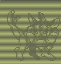
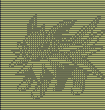
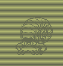
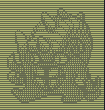

# Jolt - Sprite Extractor

<p float="left">
  
  
  
  
  
  
  
</p>

Welcome to the Jolt repository! This project provides a straightforward script for extracting the sprites of the first generation of Pokémon and saving them in binary format.

### Features

- Simple Extraction: The script is designed to be easy to use, making sprite extraction a hassle-free process.
- First Generation Pokémon: Specifically tailored for extracting sprites from the first generation of Pokémon games.
- Binary Output: Save extracted sprites in binary format for versatile usage.

### Usage

Before you begin the setup, make sure you have the sprites. You can obtain them from projects like [pokered](https://github.com/pret/pokered/tree/master/gfx/pokemon). After cloning the project, add the sprites to their respective folders within the "sprites" directory.

Before continue, make sure you have node and a package manager installed.

1. Clone the repository to your local machine:

```bash
git clone https://github.com/victorheringer/jolt
```

2. Navigate to the project directory:

```bash
cd jolt
```

3. Install dependencies:

```bash
yarn install
```

3. Run the script:

```bash
yarn extract
```

### Contribution

Feel free to contribute to the project by forking the repository and submitting pull requests. If you encounter any issues or have suggestions, please open an issue in the issue tracker.

### License

This project is licensed under the MIT License.

Happy sprite extracting with Jolt!
